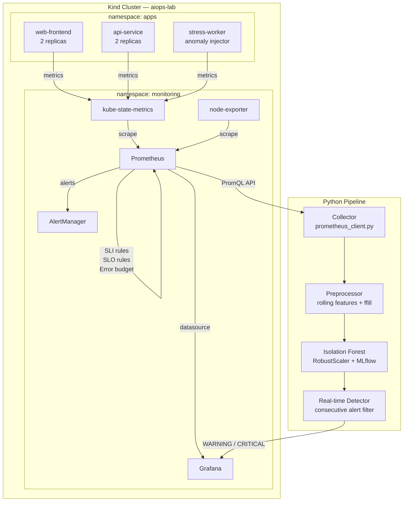
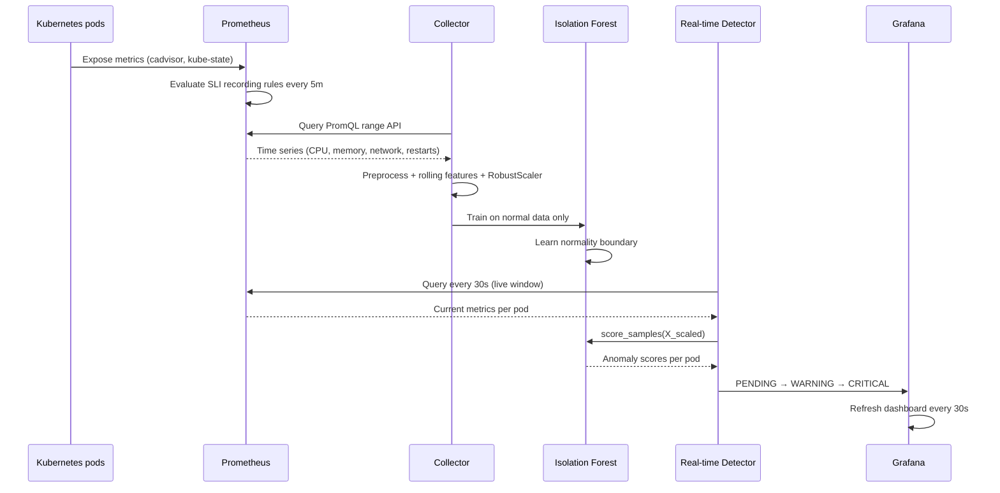
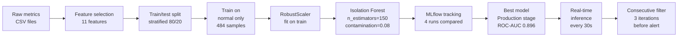
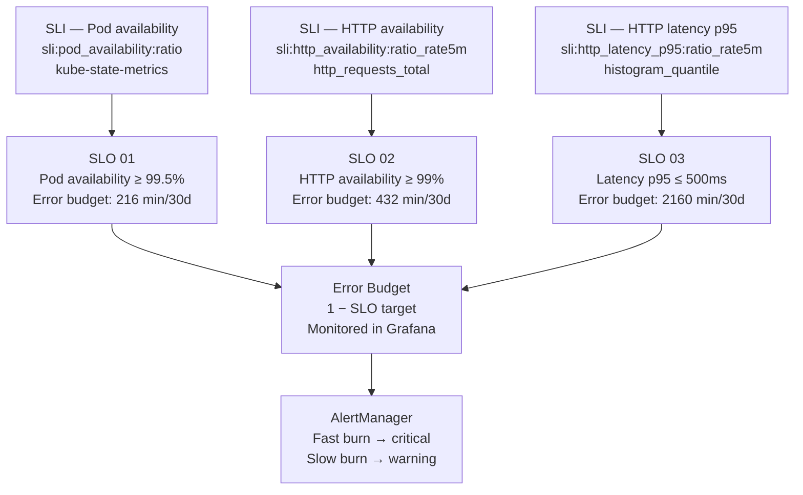
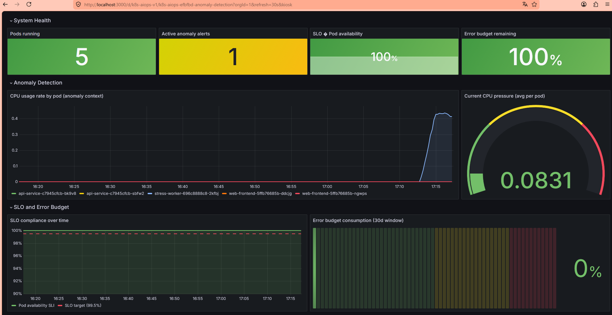

# k8s-anomaly-detector

> Real-time anomaly detection for Kubernetes using Prometheus metrics and Isolation Forest.
> A production-grade AIOps portfolio project built with modern open-source tooling.


---

## The problem it solves

Production Kubernetes clusters emit thousands of metrics per second across hundreds of pods. Detecting anomalous behavior manually — CPU spikes, memory leaks, network saturation — is impossible at scale and too slow to prevent user impact.

This system learns what "normal" looks like for each pod and automatically detects deviations in real time, before users notice. Anomalies are correlated with SLO compliance and Error Budget consumption to prioritize response based on business impact.

---

## Architecture



---

## System flow



---

## ML pipeline



---

## SLO framework



---

## Stack

| Layer | Technology | Reason |
|-------|-----------|--------|
| Cluster | Kind | Fast startup, used in CI/CD pipelines, multi-node, no VM overhead |
| Package manager K8s | Helm 3 | Production standard for deploying any workload to Kubernetes |
| Monitoring | kube-prometheus-stack | Prometheus + Grafana + AlertManager + Operator bundled, production-grade |
| Python deps | uv | 10-100x faster than pip, modern PEP 517 standard |
| ML | Scikit-learn · Isolation Forest | Unsupervised — works without labeled anomalies, scales to production |
| Experiment tracking | MLflow | Reproducible model selection, audit trail of all runs |
| Code quality | ruff + pre-commit | Linting and formatting enforced on every commit, zero manual discipline |
| Automation | Makefile | All operations as single commands — cluster, training, inference, demo |

---

## Model performance

Four experiments tracked in MLflow with varying hyperparameters:

| Run | n_estimators | contamination | F1 | Precision | Recall | ROC-AUC |
|-----|-------------|---------------|-----|-----------|--------|---------|
| 1 | 100 | 0.148 | 0.708 | 0.630 | 0.810 | 0.893 |
| **2 ✓** | **150** | **0.08** | **0.711** | **0.667** | 0.762 | **0.896** |
| 3 | 250 | 0.10 | 0.708 | 0.630 | 0.810 | 0.898 |
| 4 | 300 | 0.10 | 0.696 | 0.640 | 0.762 | 0.888 |

**Run 2 selected as Production:** highest F1 combined with best Precision (fewer false positives in a shared cluster environment). Promoted via MLflow Model Registry.

---

## Key design decisions

**Why train only on normal data?**
In production, anomalies are rare and unlabeled. Training Isolation Forest exclusively on normal behavior simulates the real-world constraint — the model learns the boundary of normality rather than memorizing specific anomaly patterns. This means it generalizes to anomaly types it has never seen.

**Why RobustScaler over StandardScaler?**
CPU anomalies in this dataset create extreme outliers — 170x the normal mean during stress injection. RobustScaler uses median and IQR instead of mean and std, making it resistant to exactly these spikes. StandardScaler would distort the feature space and degrade detection accuracy.

**Why a consecutive alert filter?**
A shared Kind cluster runs on the host machine alongside Docker Desktop and WSL, creating transient CPU fluctuations that trigger single-iteration false positives. Requiring 3 consecutive detections above threshold before confirming an alert eliminates noise without retraining the model or raising the threshold to the point where real anomalies are missed.

**Why Kind over Minikube?**
Kind runs Kubernetes inside Docker containers with no VM overhead. It starts in under 45 seconds, supports multi-node clusters, and is the tool of choice for Kubernetes CI/CD pipelines at companies like Google and HashiCorp. Minikube's addon system abstracts away configuration that engineers encounter in real clusters.

---

## SLIs, SLOs and Error Budgets

| SLO | Metric (SLI) | Target | Error budget (30d) |
|-----|-------------|--------|-------------------|
| Pod availability | `sli:pod_availability:ratio` | 99.5% | 216 min downtime |
| HTTP availability | `sli:http_availability:ratio_rate5m` | 99% | 432 min downtime |
| HTTP latency p95 | `sli:http_latency_p95:ratio_rate5m` | 95% under 500ms | 2160 min |

Error budgets are calculated as recording rules in Prometheus and visualized in Grafana. When the anomaly detector fires, the Grafana dashboard shows whether the anomaly is actively consuming Error Budget — this is used to prioritize incident response.

---

## Project structure

```
k8s-anomaly-detector/
├── Makefile                              # All operations as single commands
├── pyproject.toml                        # uv-managed dependencies
├── .pre-commit-config.yaml               # ruff + quality hooks on every commit
├── .env.example                          # Environment variable reference
│
├── k8s/
│   ├── cluster/
│   │   └── kind-config.yaml              # 3-node Kind cluster definition
│   ├── manifests/
│   │   ├── namespace.yaml                # apps namespace with monitoring label
│   │   ├── web-frontend.yaml             # nginx — baseline traffic generator
│   │   ├── api-service.yaml              # httpbin — variable load simulation
│   │   └── stress-worker.yaml            # stress-ng — controlled anomaly injector
│   └── monitoring/
│       ├── prometheus-values.yaml        # kube-prometheus-stack Helm values
│       ├── slo-rules.yaml                # SLI/SLO/Error budget PrometheusRules
│       └── dashboards/
│           └── aiops-main.json           # Grafana dashboard (GitOps versioned)
│
├── src/
│   ├── collector/
│   │   ├── prometheus_client.py          # Prometheus HTTP API v1 wrapper
│   │   ├── queries.py                    # PromQL query definitions per metric
│   │   └── preprocessor.py              # Feature engineering + rolling stats
│   └── detector/
│       ├── features.py                   # Feature selection + RobustScaler
│       ├── trainer.py                    # Isolation Forest + MLflow tracking
│       └── realtime.py                   # Real-time detection with consecutive filter
│
├── notebooks/
│   ├── 01_eda.ipynb                      # EDA — metric distribution, correlation matrix
│   └── 02_model_evaluation.ipynb         # ROC curve, confusion matrix, score timeline
│
├── scripts/
│   ├── inject_anomaly.sh                 # Controlled CPU + memory stress injection
│   ├── port_forward.sh                   # Expose Prometheus + Grafana locally
│   └── demo.sh                           # Full end-to-end automated demo
│
└── data/
    └── raw/                              # Collected metric CSVs (gitignored)
```

---

## Quick start — full setup from scratch

### Prerequisites

- Windows with WSL2 (Ubuntu 22.04+)
- Docker Desktop with WSL2 integration enabled
- ~8GB RAM available for the cluster

### 1. Install tooling

```bash
# kubectl
curl -LO "https://dl.k8s.io/release/$(curl -Ls https://dl.k8s.io/release/stable.txt)/bin/linux/amd64/kubectl"
chmod +x kubectl && sudo mv kubectl /usr/local/bin/

# Kind
curl -Lo ./kind https://kind.sigs.k8s.io/dl/v0.23.0/kind-linux-amd64
chmod +x kind && sudo mv kind /usr/local/bin/

# Helm
curl https://raw.githubusercontent.com/helm/helm/main/scripts/get-helm-3 | bash

# uv
curl -LsSf https://astral.sh/uv/install.sh | sh && source $HOME/.local/bin/env
```

### 2. Clone and configure

```bash
git clone https://github.com/<your-username>/k8s-anomaly-detector.git
cd k8s-anomaly-detector
cp .env.example .env
uv sync
uv run pre-commit install
```

### 3. Bootstrap the environment

```bash
make cluster-up        # Create 3-node Kind cluster (~45s)
make monitoring-up     # Install kube-prometheus-stack via Helm (~3-5 min)
make apps-deploy       # Deploy web-frontend, api-service, stress-worker
```

### 4. Collect metrics and train the model

```bash
# Collect 30 minutes of normal baseline
make collect-normal

# In another terminal — inject anomaly while collecting
make inject-anomaly &
make collect-anomaly

# Train model (runs 3 experiments by default)
make train

# Optional: run additional experiments
make train ARGS="--n-estimators 150 --contamination 0.08"
make train ARGS="--n-estimators 250 --contamination 0.10"
```

### 5. Run the full demo

```bash
# Start MLflow tracking server (keep running in background)
make mlflow-server &

# Run automated end-to-end demo:
# - verifies cluster and apps
# - starts port-forwards
# - starts real-time detector
# - waits 60s for baseline
# - injects anomaly automatically
make demo
```

Expected output during anomaly injection:

```
[16:04:25] Iteration 3 — 5 pods evaluated
[PENDING]  pod=stress     score=0.7589  time=16:04:25
[OK]       pod=api        score=0.5496  time=16:04:25
...
[16:05:56] Iteration 6 — 5 pods evaluated
[WARNING]  pod=stress     score=0.7589  time=16:05:56   ← confirmed after 3 consecutive
[OK]       pod=api        score=0.5690  time=16:05:56
16:05:56 | WARNING | CONFIRMED ANOMALIES: 1 pods | scores: [0.7589]
```

### 6. Explore dashboards

| Interface | URL | Credentials |
|-----------|-----|-------------|
| Grafana dashboard | `http://localhost:3000/d/k8s-aiops-v1` | admin / aiops-lab-2024 |
| Prometheus UI | `http://localhost:9090` | — |
| MLflow experiments | `http://localhost:5000` | — |

---

## Available Make commands

```
make help              Show all available commands

# Cluster
make cluster-up        Create Kind cluster (3 nodes)
make cluster-down      Destroy Kind cluster

# Monitoring
make monitoring-up     Install kube-prometheus-stack via Helm
make monitoring-down   Uninstall monitoring stack
make monitoring-status Show monitoring pod status
make import-dashboard  Import Grafana dashboard from JSON
make port-forward      Start port-forwards for Prometheus and Grafana

# Applications
make apps-deploy       Deploy demo apps to namespace apps
make apps-status       Show app pod status
make apps-down         Delete apps namespace

# Data collection
make collect-normal    Collect 30 min of normal baseline metrics
make collect-anomaly   Collect metrics during anomaly window
make inject-anomaly    Inject CPU + memory stress for 120s

# Model
make train             Train Isolation Forest with default params
make mlflow-server     Start MLflow tracking UI on localhost:5000
make evaluate          Launch model evaluation notebook

# Detection and demo
make detect-realtime   Start real-time anomaly detector
make demo              Full end-to-end automated demo

# Development
make test              Run test suite with coverage
make lint              Run ruff linter
make eda               Launch EDA notebook
make clean             Remove Python cache and build artifacts

# Full setup
make setup             cluster-up + monitoring-up + apps-deploy
```

---

## Grafana dashboard panels

| Panel | Type | What it shows |
|-------|------|---------------|
| Pods running | Stat | Total ready pods vs desired in namespace apps |
| Active anomaly alerts | Stat | Firing alerts from AlertManager |
| SLO pod availability | Stat | Current availability % vs 99.5% target |
| Error budget remaining | Stat | % of monthly error budget not yet consumed |
| CPU usage rate by pod | Time series | Per-pod CPU with two anomaly spikes visible |
| Current CPU pressure | Gauge | Aggregated CPU — green/yellow/red thresholds |
| SLO compliance over time | Time series | SLI vs dashed SLO target line |
| Error budget consumption | Bar gauge | Monthly budget consumed as LCD bar |
| Memory working set | Time series | Per-pod memory — detects leaks as upward trend |
| Pod restarts | Time series | Cumulative restarts — any value > 0 flags instability |
| Pod status table | Table | Live pod state with color-coded Ready column |

---

## Teardown

```bash
make cluster-down      # Destroys all Kind containers and cluster state
```

All application state is ephemeral by design. The cluster is fully reconstructable from code in under 10 minutes with `make setup`.


> 📸 **Screenshot Grafana Dashboard — Demo**
>
> *(screenshot after running demo `./scripts/demo.sh`)*
>
> 
